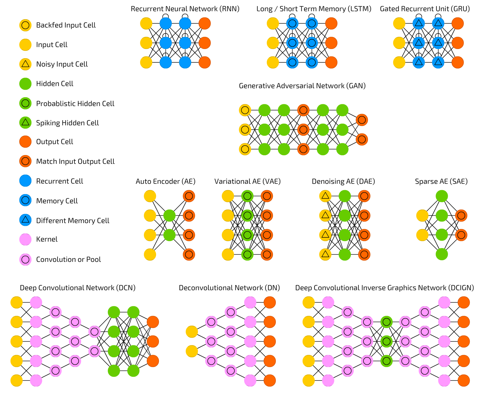

```{r setup, include=FALSE}
options(htmltools.dir.version = FALSE)
```
# Papers

LeCun, Y., Bengio, Y. & Hinton, G.  
**Deep learning.**  
*Nature* 521, 436–444 (2015)  
[doi:10.1038/nature14539](ttps://doi.org/10.1038/nature14539)

Angermueller, C., Pärnamaa, P., Parts, L. & Stegle, O.  
**Deep learning for computational biology.**  
*Mol.Syst Biol* 12:878 (2016)  
[doi:10.15252/msb.20156651](https://doi.org/10.15252/msb.20156651)

Ching et al. (2018)  
**Opportunities And Obstacles For Deep Learning In Biology And Medicine**   
[preprint doi:10.1101/142760](https://doi.org/10.1101/142760)

---
# What is Deep learning?

---
# Neural Networks



Image credit: [Neural network Zoo](http://www.asimovinstitute.org/neural-network-zoo/)

---

