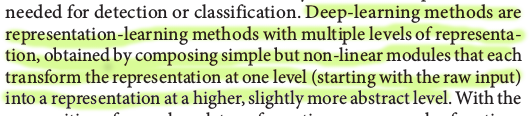
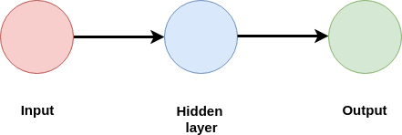
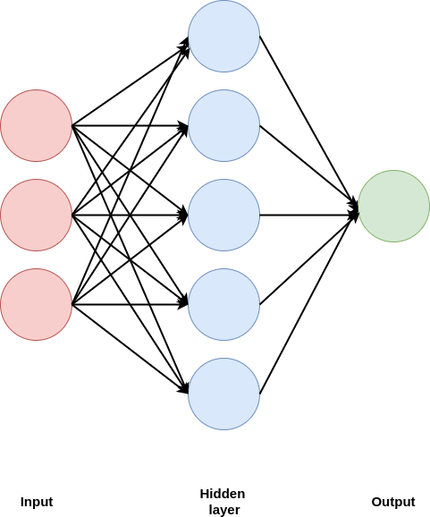
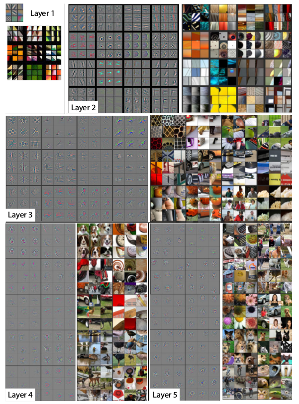
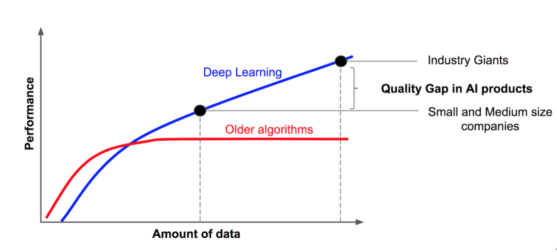
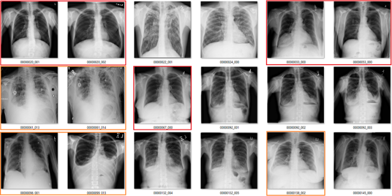
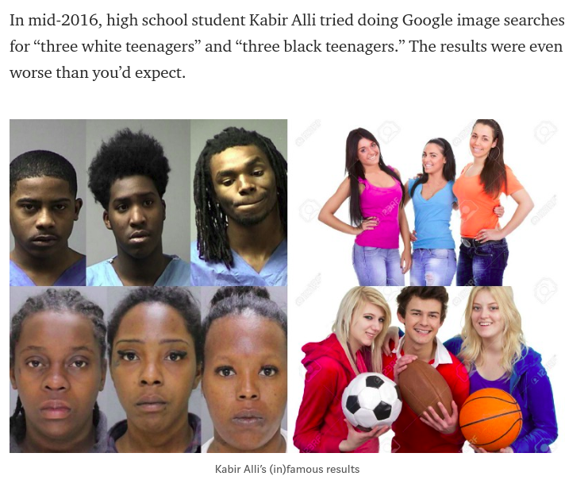
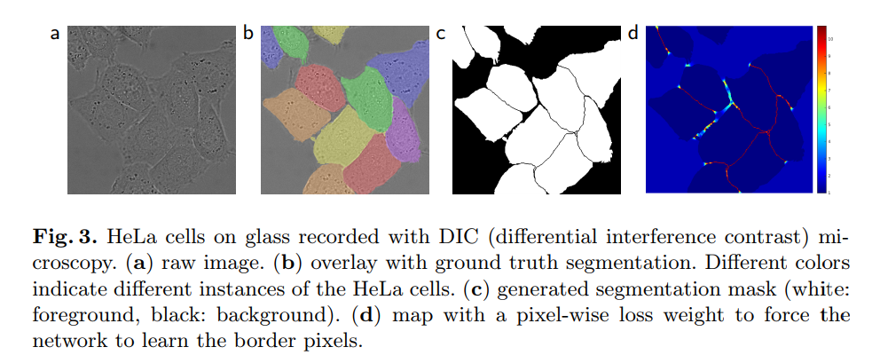
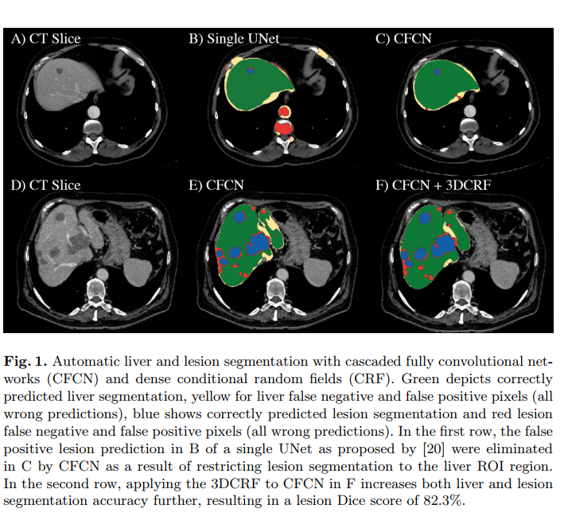

layout: true

<div class="my-footer"><span>Journal club: 7-Mar-2018, Karla</span></div>

---
```{r setup, include=FALSE}
options(htmltools.dir.version = FALSE)
```
# Papers

LeCun, Y., Bengio, Y. & Hinton, G.  
**Deep learning.**  
*Nature* 521, 436–444 (2015)  
[doi:10.1038/nature14539](ttps://doi.org/10.1038/nature14539)

Angermueller, C., Pärnamaa, P., Parts, L. & Stegle, O.  
**Deep learning for computational biology.**  
*Mol.Syst Biol* 12:878 (2016)  
[doi:10.15252/msb.20156651](https://doi.org/10.15252/msb.20156651)

Ching et al. (2018)  
**Opportunities And Obstacles For Deep Learning In Biology And Medicine**   
[preprint doi:10.1101/142760](https://doi.org/10.1101/142760)

---

# What is Deep learning?

.pull-left[
Input $\longrightarrow$ hidden layers $\longrightarrow$ output



**Input** - measured variables:
* intensity of a pixel in an image
* expression level of a gene

**Output: **
* labels/categories (supervised learning)
* patterns (unsupervised learning)
]


---

# What is Deep learning?

.pull-left[
```{r lm1, warning=FALSE, echo=FALSE, message=FALSE}
library(ggplot2)
set.seed(42)
n = rep(25:100,2)
a = -40
b = 2
sig2 = n^1.2
eps = rnorm(n, mean = 0, sd = sqrt(sig2))
y = a+b*n + eps
data = data.frame(x = n, y = y)
mod = lm(y~n)
ggplot(data, aes(x = x, y = y)) +
  scale_x_continuous(limits = c(0, 100)) +
  scale_y_continuous(limits = c(0, 180)) +
  theme_bw() +
  theme(axis.title.x = element_blank(),
        axis.title.y = element_blank(),
        axis.text.x = element_blank()) +
  geom_point() 
```
]

---

# What is Deep learning?

.pull-left[
```{r lm2, warning=FALSE, echo=FALSE, message=FALSE}
ggplot(data, aes(x = x, y = y)) +
  scale_x_continuous(limits = c(0, 100)) +
  scale_y_continuous(limits = c(0, 180)) +
  theme_bw() +
  theme(axis.title.x = element_blank(),
        axis.title.y = element_blank(),
        axis.text.x = element_blank()) +
  geom_point() +
  geom_smooth(method = 'lm')
```
]

---

# What is Deep learning?

.pull-left[
```{r relu, warning=FALSE, echo=FALSE, message=FALSE}
x <- seq(from = 0, to = 100, by = 0.5)
relu <- function(x)
  sapply(x, function(y) max(0, 
                            mod$coefficients[2]*y+mod$coefficients[1]))

relufit <- data.frame(x = x, relu = relu(x)) 
  
ggplot(data, aes(x = x, y = y)) +
  scale_x_continuous(limits = c(0, 100)) +
  scale_y_continuous(limits = c(0, 180)) +
  theme_bw() +
  theme(axis.title.x = element_blank(),
        axis.title.y = element_blank(),
        axis.text.x = element_blank()) +
  geom_point() +
  geom_line(data = relufit, aes(x = x, y = relu), 
            color = "red",
            size = 2)
```
]

--

.pull-right[


]

---

# What is Deep learning?

.pull-left[
```{r relu2, warning=FALSE, echo=FALSE, message=FALSE}
ggplot(data, aes(x = x, y = y)) +
  scale_x_continuous(limits = c(0, 100)) +
  scale_y_continuous(limits = c(0, 180)) +
  theme_bw() +
  theme(axis.title.x = element_blank(),
        axis.title.y = element_blank(),
        axis.text.x = element_blank()) +
  geom_point() +
  geom_line(data = relufit, aes(x = x, y = relu), 
            color = "red",
            size = 2)
```
]

.pull-right[


]

---

# What is Deep learning?

.pull-left[
Input $\longrightarrow$ hidden layers $\longrightarrow$ output


**Input** - measured variables:
* intensity of a pixel in an image
* expression level of a gene

**Output: **
* labels/categories (supervised learning)
* patterns (unsupervised learning)

.small[Image from Zeiler M.D., Fergus R. (2014). Visualizing and Understanding Convolutional Networks. ECCV 2014. ECCV 2014, Part I, LNCS 8689, 818–833, [doi: 10.1007/978-3-319-10590-1_53](https://doi.org/10.1007/978-3-319-10590-1_53)]
]

.pull-right[


]

---
background-image: url(./journal_club_201803_files/neuralnetworks.png)
background-size: 80%
background-position: 30% 20%
class: bottom

Image credit: [Neural network Zoo](http://www.asimovinstitute.org/neural-network-zoo/)

---

# Why deep learning?


.small[Image credit: [https://hackernoon.com/](https://hackernoon.com/%EF%B8%8F-big-challenge-in-deep-learning-training-data-31a88b97b282)]

---

# The main challenge: get the training data


.small[Image credit: [https://hackernoon.com/](https://hackernoon.com/%EF%B8%8F-big-challenge-in-deep-learning-training-data-31a88b97b282)]
---

# The main challenge: get the training data

.pull-left[
* correct labels


.small[Image credit: [https://lukeoakdenrayner.wordpress.com/2017/12/18/the-chestxray14-dataset-problems/](https://lukeoakdenrayner.wordpress.com/2017/12/18/the-chestxray14-dataset-problems/)]
]
--
.pull-right[
* bias in the data


.small[[https://medium.com/@yonatanzunger/](https://medium.com/@yonatanzunger/asking-the-right-questions-about-ai-7ed2d9820c48)]

]

---

# Applications

* annotate gene expression patterns
* prediction of DNA methylation sites
* image segmentation
* prediction of protein function from sequence
* generate new compounds predicted to be active against a biological target
* classification of skin cancer type based on photos
* classification of cells according to their cell cycle stage based on image data 
---

# Image Segmentation

Ronneberger O., Fischer P., Brox T. (2015) U-Net: Convolutional Networks for Biomedical Image Segmentation.  
In: Navab N., Hornegger J., Wells W., Frangi A. (eds) Medical Image Computing and Computer-Assisted Intervention – MICCAI 2015. Lecture Notes in Computer Science, vol 9351. Springer, Cham



---

# Image Segmentation

Christ P. F., Elshaer M. E. A., Ettlinger F. et al. (2016) Automatic liver and lesion segmentation in ct using cascaded fully convolutional neural networks and 3D conditional random fields.  
In: International conference on medical image computing and computer-assisted intervention. Springer International Publishing; 2016. p. 415–23. 4.

.img_small[

]
